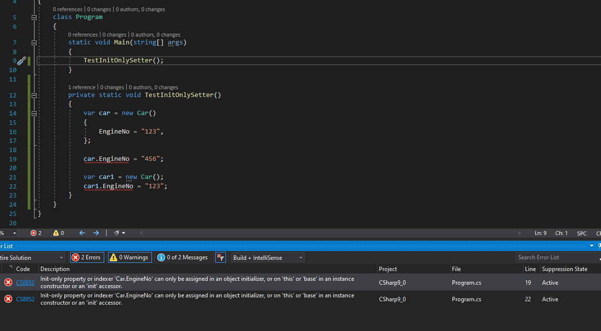
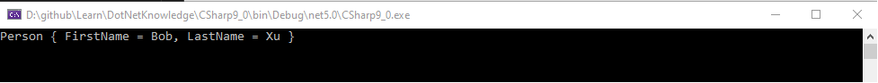
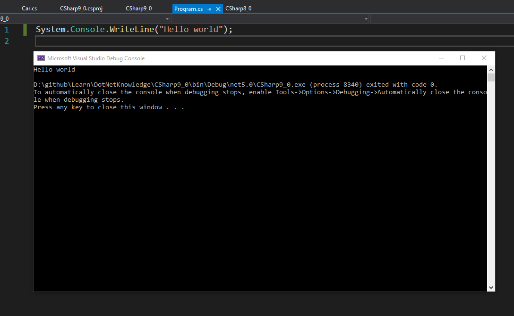
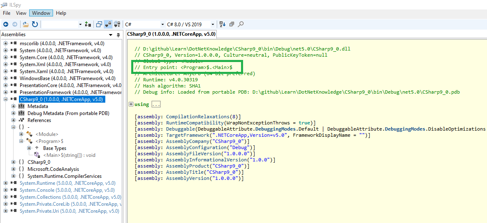

>微信公众号：**[Fintech技术汇](#jump_fintech)**
作者为软件开发工程师，就职于金融信息科技类公司，通过CFA一级，分享计算机和金融相结合领域的技术和知识。

# C# 9.0中的新功能

>.Net 5.0已经正式发布，作为.net的开发人员很有必要看看C# 9.0都引入了哪些功能，本文参考微软官方文档做些总结：https://docs.microsoft.com/en-us/dotnet/csharp/whats-new/csharp-9

### 1. 仅初始化的setters(Init only setters)

>在创建对象时，我们经常使用属性初始化器，这样的好处是：可以清楚的知道在为哪个属性赋值，然而属性初始化器要求属性必须有setter，在C# 9.0中引入了init，它允许在构造对象的过程中修改属性，从而可以使用使用属性初始化器的方式初始化属性，注意在对象创建完毕后就不再允许修改了，下面是一个例子：

```csharp
    public class Car
    {
        public string EngineNo { get; init; }

        public string Color { get; set; }

        public double Miles { get; set; }
    }
```

>上面的代码声明了一个类Car，它包含EngineNo, Color，Miles三个属性，这里需要注意的是EngineNo属性的定义，我们可以看到使用了C#之前的保留关键字init，这样EngineNo属性只有在构造对象的过程中可以被修改，一旦对象创建完成就是不可变的了。测试代码如下，可以看到在16行成功的在对象初始化器里使用了属性EngineNo的初始化器，而在19和22行试图在对象已经创建完毕后改变EngineNo属性时，编译器给出了错误提示。



>

### 2. record类型

>我们都知道.Net的类型分为值类型和引用类型：struct，enum，tuple以及基本类型是值类型，而引用类型包括class， delegate等。在程序中，值类型占比较小，引用类型占比较大，也就是说我们在程序中使用的大部分是引用类型。关于引用类型和值类型的区别，这里不再赘述，但我们知道实现不可变的值类型较容易，而实现不可变的引用类型却有点复杂。随着并行计算的兴起，不可变的引用类型在需要共享数据时具有很多优势，因此C#9.0加入了record类型，record是9.0的一个大功能，足以单独写一篇文章介绍，这里只介绍一些基本知识。概括来说，C#编译器通过自动为record类型生成一些方法来帮助开发人员创建不可变的引用类型。record具有的特点如下：

1). 在比较两个对象相等时，使用值类型的语义，即他们的类型和属性值都相等时，两个对象才相等。

>编译器自动生成Equals，GetHashCode的重写代码，并重写运算符==,!=来实现该功能。

2). 通过重写ToString()并加入新方法PrintMembers为record类型提供一致的字符串表示，下图是一个例子：
   

3). 支持copy构造，并且在copy构造的过程中支持修改，请参见4中的例子
4). 支持with表达式，在clone已存在对象生成新对象时，可以通过with改变属性，参考代码如下：

```csharp
        public static void TestWithExpression()
        {
            Person p1 = new Person("Bob", "Xu");
            Person p2 = p1 with { LastName = "Ma" };
            System.Console.WriteLine(p1);
            System.Console.WriteLine(p2);
        }
```

>上面的代码通过p1构造p2并修改LastName为"ma"

5). 更精简的Postional Record语法

```csharp
public record Student(string FirstName, string LastName, string StudentNo) : Person(FirstName, LastName);
```

>有没有被这么精简的语法惊到？该句代码声明了一个Student record继承自Person，拥有FirstName, LastName, StudentNo三个属性，并且这些属性都是有init only setter的。

### 3. Top-Level语句

>9.0以前，为了写一个hello world console程序，我们需要创建一个类，包含一个main方法，然后在main方法中调用Console.WriteLine函数，有这个功能，我们就可以直接写如下的代码并直接运行，是不是很像python等脚本语言?



>需要指出的是，只能有一个文件包含top-level语句，而且工程中不能再有别的入口点函数如main等，因为编译器会根据top-level语句所在文件生成入口点函数，如下图所示：


### 4. 增强了模式匹配功能

>主要的增强有：

1) Type Pattern：是针对is-type-expression的重构
2) Parenthesized Patterns：开发人员可以通过括号来控制模式匹配的优先级
3) Pattern Combinators：可以使用and, or, not逻辑词连接模式
4) Relational patterns：可以比较输入值和常量值的大小
简单例子如下:

```csharp
public static bool IsLetterOrSeparator(char c) => c is (>= 'a' and <= 'z') or (>= 'A' and <= 'Z') or '.' or ',';
```

### 5. Target-typed
>在创建对象时，如果编译器能够推断出对象的类型，可以省略类型直接使用new关键字即可，主要使用在类的字段初始化，函数传参等地方

<a id="jump_fintech"></a>
