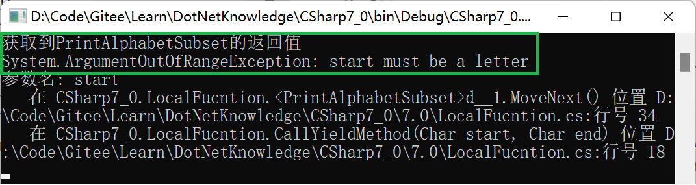
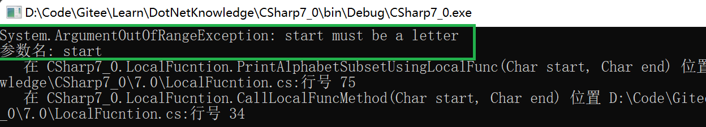

> 什么是本地函数（Local Function）？

本地函数是在C#7.0中引用的，指嵌套在其他成员中的函数，只能在包含它们的成员中调用。

> 能够声明本地函数的成员有哪些？

* 方法（尤其是迭代器方法和异步方法）
* 构造函数
* 终结器
* 属性访问器
* 事件访问器
* 匿名方法
* Lambda 表达式
* 其他本地函数
  
注意：不能在表达式体中声明本地函数

> 声明本地函数的语法
```csharp
<modifiers> <return-type> <method-name> <parameter-list>
```

modifiers： 可以是async，unsafe，static或者extern，但不能使用访问修饰符private，public，protected等。如果使用了static，那么该本地函数不能访问其外部成员中的本地变量。extern必须和static一起使用。

parameter-list: 参数列表中的参数名不能使用上下文关键字value

> 对异常的处理

与异步方法和迭代器方法不同，本地函数允许异常立即抛出。下面是迭代器方法和本地函数的对比

<center><b>使用yeild的迭代器方法</b></center>

```csharp

        public IEnumerable<char> PrintAlphabetSubset(char start, char end)
        {
            if (start < 'a' || start > 'z')
            {
                throw new ArgumentOutOfRangeException(paramName: nameof(start), message: "start must be a letter");
            }

            if (end < 'a' || end > 'z')
            {
                throw new ArgumentOutOfRangeException(paramName: nameof(end), message: "end must be a letter");
            }

            if (end <= start)
            {
                throw new ArgumentException($"{nameof(end)} must be greater than {nameof(start)}");
            }

            for (var c = start; c < end; c++)
            {
                yield return c;
            }
        }

```

<center><b>使用本地函数的方法</b></center>

```csharp
        public IEnumerable<char> PrintAlphabetSubsetUsingLocalFunc(char start, char end)
        {
            if (start < 'a' || start > 'z')
            {
                throw new ArgumentOutOfRangeException(paramName: nameof(start), message: "start must be a letter");
            }

            if (end < 'a' || end > 'z')
            {
                throw new ArgumentOutOfRangeException(paramName: nameof(end), message: "end must be a letter");
            }

            if (end <= start)
            {
                throw new ArgumentException($"{nameof(end)} must be greater than {nameof(start)}");
            }

            return AlphabetSubsetLocalFunc();

            IEnumerable<char> AlphabetSubsetLocalFunc()
            {
                for (var c = start; c < end; c++)
                    yield return c;
            }
        }
```

> 当我们使用非a-z的参数调用这两个函数时，PrintAlphabetSubset并不会立即抛出异常，而是在枚举其返回结果时抛出，比如下面的调用会先打印出“获取到PrintAlphabetSubset的返回值”，再打印异常信息。

```c#
        internal static void CallYieldMethod(char start, char end)
        {
            try
            {
                var result = new LocalFucntion().PrintAlphabetSubset(start, end);
                Console.WriteLine("获取到PrintAlphabetSubset的返回值");
                foreach (var item in result)
                {
                    Console.WriteLine(item);
                }
            }
            catch (Exception ex)
            {
                Console.WriteLine(ex.ToString());
                Console.ReadKey();
            }
        }
```



>而PrintAlphabetSubsetUsingLocalFunc方法会立即抛出异常，如下面的例子所示，并没有输出"获取到PrintAlphabetSubsetUsingLocalFunc的返回值"，而是直接抛出了异常：
```c#
        internal static void CallLocalFuncMethod(char start, char end)
        {
            try
            {
                var result = new LocalFucntion().PrintAlphabetSubsetUsingLocalFunc(start, end);
                Console.WriteLine("获取到PrintAlphabetSubsetUsingLocalFunc的返回值");
                foreach (var item in result)
                {
                    Console.WriteLine(item);
                }
            }
            catch (Exception ex)
            {
                Console.WriteLine(ex.ToString());
                Console.ReadKey();
            }
        }
```


>本地函数（Local Function）VS Lambda表达式

本地函数和Lambda表达式在很多地方可以互换，至于选择本地函数还是Lambda表达式通常也是个人偏好或编码风格的问题。但两者在以下地方还是有区别的：

1. 本地函数和普通方法一样都有名字，参数以及返回值，而Lambda表达式是需要一个代理类型的变量，如果Action，Func类的变量，此代理类型决定了Lamba表达式的函数签名，比如在C# 10之前的版本，类似var x = ()=>1;的语句是非法的，需要写成Func\<int> x=()=>1;
2. 本地函数本质上是函数，其定义在编译时确定，调用它的语句可以在其定义语句之前。Lambda表达式是对象，而对象的创建是在运行时，所以其对应变量的声明必须先用其使用
3. Lambda表达式在声明的时候会被转换成Delegate，而本地函数较为灵活，可以作为传统的函数使用，也可以作为代理使用，且只有当作为代理使用的时候，才会转化为代理对象
4. Lambda表达式总是会导致堆分配，而本地函数有可能不需要堆分配：如果本地函数不被当成Delegate使用，且其捕获的变量也不会被其他的Lambda表达式或作为Delegate使用的本地函数所捕获，那么它将不会导致Heap分配，从能够提升性能
5. 本地函数可以和普通函数一样使用yield实现iterator，而Lambda表达式不行

总之，如果只是想实现一个函数，且这个函数只能在某个其他的函数内部调用，那么可以优先使用本地函数。


<center/>


